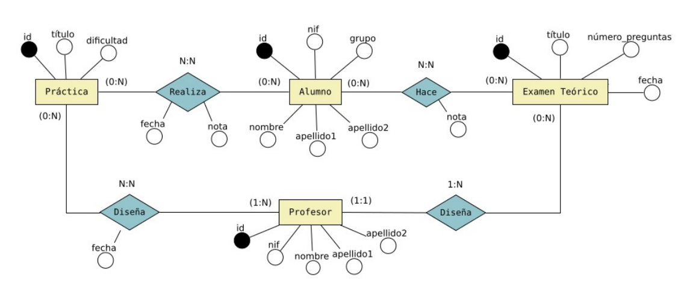

# Tarea: Realiza el MVC para los siguientes diagramas
E-R. Ya tenemos los modelos DAO hechos



# Requerimientos
- Agregar las librerias dentro de la carpeta ``lib/``
- configurar el archivo ``.env`` con las credenciales correctas
- Abrir solamente este projecto para que tome como raiz, o se cambiará la posicion del archivo ``env``

## ¿Si pierdo el env?
Puedes saber en donde está buscando el .env con:
```java
import com.darkredgm.querymc.Env.Env;

public class Main
{
    static main()
    {
        System.out.println( new Env().whereAmI() );
    }
}
```
Salida
```cmd
C:\Users\xxx\...\TareaPracticaAlumno\.env
```

# Migración
Este proyecto utiliza una base de datos distinta, por lo que para evitar errores, hay una funmcion que carga todas las clases, modelos, contenido

```java
import Database.Migration;

import java.sql.SQLException;

void main() throws SQLException {
    // Para cargar la base de datos y los modelos,
    // esto creara una nueva base de datos
    // junto a los modelos correspondientes
    Migration.load(); //<- Puedes eliminar luego de cargarlo por primera vez

    // Cargar la app
    new App().init();
}
```
